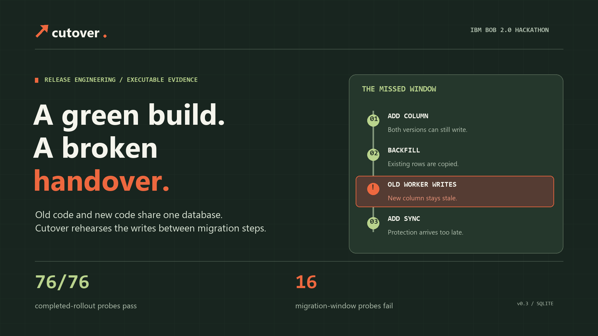

# Cutover

**A green build can still be a broken handover.**



Cutover rehearses schema-changing releases while old and new application versions share a database. It executes their SQL contracts against disposable SQLite databases and checks that every reader sees the latest acknowledged write, including after application rollback.

This is a documented release problem, not a hypothetical one. [GitLab's account of mixed-version incidents](https://docs.gitlab.com/development/multi_version_compatibility/#examples-of-previous-incidents) describes a migration that passed canary QA while older production instances still failed to insert records. [Its migration guidance](https://docs.gitlab.com/development/database/avoiding_downtime_in_migrations/#renaming-columns) explains why a direct column rename requires downtime when old application code may still use the old name. [Stripe's published online-migration sequence](https://stripe.com/blog/online-migrations) starts dual-writing before backfill; Cutover's late-bridge sample deliberately reverses that order to expose the gap. Cutover tests a narrower, original SQLite sample of this failure class; it has not analyzed either company's repository or prevented those incidents.

The prototype is functional and [the public demo](https://cutover-rehearsal.onrender.com/) is live on Render's free tier. [The source](https://github.com/josepha-mayo/cutover) is public. The IBM Bob MCP transport has been checked with a real SDK client and a read-only Bob Shell call before kickoff. An event-period Bob contribution and final submission assets remain outstanding. This is pre-event preparation created with Codex, not a claim of work performed by Bob during the event. The free demo may take around a minute to wake after inactivity.

## Run

Python 3.10+ with SQLite 3.25+ is sufficient for the app. No runtime packages, API keys, database account, or build tool are required.

```powershell
python server.py
```

Open http://127.0.0.1:8765. The server binds only to loopback by default. The same bounded app is hosted at [cutover-rehearsal.onrender.com](https://cutover-rehearsal.onrender.com/); it is a hackathon demo, not a hardened public multi-tenant service.

## Try the three-minute story

1. **Late bridge** is selected on first load. Press **Run selected migration** in the first screen. All 76 completed-rollout probes pass, yet 16 of 48 migration-window probes fail. An old write after the backfill and before the triggers silently leaves the new column stale. Select a red square to inspect the shortest observed failing replay, executed SQL, and expected/observed values. Pin this result as a baseline before trying another plan.
2. Select **Direct rename**, then run. All 8 new-version checks pass, but Cutover catches 60 failing completed-rollout probes, including an old worker querying a removed column.
3. Select **Expand & backfill**, then run. New-version checks still pass. A write is acknowledged but the other version reads stale data.
4. Select **Window-safe bridge**. Moving synchronization before backfill preserves data through all 124 tested probes. Append `DROP TRIGGER sync_new_update;` to its migration and rerun; 12 failures return. Results are computed from SQL, never chosen by candidate name.
5. Click **Run the cross-record trap**. It starts from the window-safe bridge but adds a prewritten trigger that silently resets row 101 after a write to row 102. The same-version baseline and every migration-window probe pass, yet cross-record write replays block the candidate and show both write IDs plus the lost value. This is a synthetic negative control, not a real incident or Bob result.
6. Compare the pinned baseline with the current run. Cutover counts resolved and regressed probes only where the contract and evaluator match; if migration SQL changes, it reports each plan's window failures separately because their statement boundaries cannot be paired. Export evidence and its Markdown review, save/import a candidate, or prepare a repair task for IBM Bob.

The browser includes two curated contracts: Parcel's address migration and Relay's contact-field migration. They demonstrate the same structural failure on different identifiers and seed data. They are sample SQL adapters, not claims of integration with production services or full ORM applications. Inputs deliberately stress string preservation and do not validate contact syntax.

**Run your own migration in the browser:** import a contract JSON and a five-field candidate plan JSON, then press **Run release rehearsal**. Or click **Try warehouse example** to load a clearly labelled prewritten fixture without file handling; it still needs a fresh execution before a verdict appears. The [warehouse contract](examples/warehouse/contract.json) and its [late](examples/warehouse/late_bridge.json) and [window-safe](examples/warehouse/bridge.json) plans are ready-to-try examples. The browser validates the old adapter before enabling the custom case, runs the plan in the same bounded disposable worker as the CLI, and maps old-worker updates and inserts at each migration-statement boundary. Select a window to inspect its executed replay. You can export JSON evidence, a Markdown review, the contract, and the plan. A blocked data mismatch also offers a standalone Python replay that reruns the exact SQL witness in disposable SQLite. A changed plan clears the old verdict until rerun. The hosted service receives imported SQL but does not persist it; use a local instance for private schemas. The Bob MCP tools accept the same imported contract and run it through the bounded worker. Pass the complete contract on each custom rehearsal call; no server-side contract is stored.

## Bring your own contract through the CLI

A developer can supply a bounded single-table SQLite contract and candidate plan as JSON. The [warehouse contract](examples/warehouse/contract.json) is a complete example with its own bin-code payloads. Its [late synchronization plan](examples/warehouse/late_bridge.json) misses an acknowledged old-worker move; its [window-safe plan](examples/warehouse/bridge.json) passes the reported suite.

```powershell
python -m cutover --contract examples/warehouse/contract.json --plan examples/warehouse/late_bridge.json --output work/warehouse-late.json --markdown work/warehouse-late.md --repro work/warehouse-late-replay.py
python -m cutover --contract examples/warehouse/contract.json --plan examples/warehouse/bridge.json --output work/warehouse-safe.json --markdown work/warehouse-safe.md
python -m cutover.audit_report --contract examples/warehouse/contract.json --plan examples/warehouse/late_bridge.json --report work/warehouse-late.json
```

Contract import checks that the fixed old reader, updater, and inserter work with every declared payload on fresh databases before attributing failures to a migration.

The first command exits 1 with a blocked 108/124 verdict; its shortest observed witness has `R-07` expected and `A-01` observed. The second exits 0 with 124/124 on this particular contract. The Markdown file is generated from the same executed report object as JSON, with a trace, bound inputs, expected/observed values, hashes and limitations. Run `python work/warehouse-late-replay.py` to reproduce its recorded data gap without Cutover installed.

The audit command reruns the checked-in contract and plan in a fresh bounded worker. It compares every replayable report field and checks any attached Markdown review or standalone witness against the report. Creation time, runtime and host SQLite version are self-reported. It exits 0 for a verified pass, 1 for a verified block, and 2 if the report differs or cannot be replayed. Changing the shown passing replay or Bob attribution invalidates the report.

The imported contract must define `project`, `summary`, `table`, distinct `old_column`/`new_column`, initial `schema`, `seed_sql`, 1–16 `[id, value]` seed rows, an `old` read/write/insert adapter, and 2–8 domain-specific `payloads`. SQL identifiers and input sizes are bounded. The initial schema must contain exactly the named table, with no views or triggers. The old adapter must pass reads, updates of every seed ID, and an insert before migration evidence is produced. Run private schemas locally. This is a contract importer, not automatic extraction from a repository or a production-database connector.

## What executes

Each probe gets a fresh in-memory database and a copy of fixed seed records. Every update-containing probe is rerun against each seeded record; two-write probes rotate their second target across schedules and payloads so a later write can expose corruption of an earlier one. Every insert probe tries two new IDs. The failing trace names the write path that exposed the gap. With 1–16 seeds and 2–8 payloads, a passing full suite covers every ordered seed pair at least once without adding replays. It does not cover every pair under every schedule and payload combination. The old adapter is fixed; the candidate supplies migration SQL and new read/update/insert queries. Each acknowledged write updates an independent Python record ledger. A read must return exactly those records and values. The runner generates 19 completed-rollout schedules for every supplied input string, then inserts old updates and inserts at every SQLite statement boundary of the migration. Bundled samples use four strings; an imported contract chooses 2–8 domain-specific payloads. The total varies with the payload and migration-statement counts. Same-version baseline tests are reported separately.

Each migration-window replay now checks an old-worker read immediately after its old write or insert, before the remaining migration statements run. This catches a temporarily broken old reader even if later statements repair the final database. The engine detects schema errors, stale values, missing records, ignored writes, and unintended writes to other records. Reports include inputs, executed statements, replay prefixes, coverage, SQLite/engine versions and hashes of the candidate, contract, suite and engine source. Hashes identify inputs; they are not signed attestations.

Each probe runs migration, old-worker, and new-worker SQL on separate connections to its disposable in-memory database. The trace names the connection for every step, and the standalone witness uses the same separation. Operations remain sequential: this does not model concurrent transactions, locks, or network timing.

A no-op migration cannot pass by keeping the "new" adapter on the old field: the new reader must access the fixed target column without reading the old column, new updates and inserts must carry their values into the target directly, and the target column itself must match the independent ledger after every successful replay. A trigger-free shadow of each new update or insert rejects a no-op target assignment or old-only insert that relies on an old-column synchronization trigger; explicit dual-writes remain valid. This also rejects a reader that touches the target in a no-op expression while returning old-column data. The target column and table come from the fixed contract supplied for that run, not from the candidate.

The smallest failure shown is the **shortest observed failing prefix in this suite**, not a globally minimal counterexample. Rollback means returning traffic to the old application while retaining the expanded database, not executing a down migration.

## Measured impact in the sample challenge

Among the original three unsafe rollout patterns in the controlled ablation, the new-version baseline detects 0/3, completed-rollout checks detect 2/3, and adding migration-statement windows detects 3/3. The late bridge alone passes 76/76 completed-rollout probes but fails 16 window probes. The separate cross-record trap adds a fourth negative control: 8/8 baseline and 56/56 windows pass, but two-write probes find 32 failures in both bundled contracts. These are [curated fixture results](docs/IMPACT.md), not a customer benchmark or measured time saving. Recompute the original ablation with `python -m evidence.build_ablation`.

## Bob integration

The optional integration uses the official MCP Python SDK v1, pinned to the version tested here.

```powershell
python -m venv .venv
.venv\Scripts\python -m pip install -r requirements-mcp.txt
python configure_bob.py --python .venv\Scripts\python.exe
.venv\Scripts\python tests/check_mcp.py
```

On macOS/Linux, use `.venv/bin/python` instead. `configure_bob.py` creates a project-local `.bob/mcp.json` with absolute paths and preserves other server entries. It leaves automatic tool approval off.

For the repair task, first freeze a reference-withheld sibling workspace from a clean commit:

```powershell
python prepare_bob_session.py --python .venv\Scripts\python.exe
```

Open the printed `cutover-bob-session-<commit>` folder in Bob and select **Cutover release engineer**. It contains the same evaluator and failing sample plans, but no bundled passing plan, presentation materials or prior repair notes. The custom mode permits reading and MCP calls, with edits limited to candidate JSON and notes under `work/`. The tools are `inspect_release`, `inspect_imported_contract`, `diagnose_reference`, and `rehearse_candidate`; the diagnostic tool exposes only failing references. For an imported case, validate its full contract with `inspect_imported_contract`, then supply `case=custom` and that contract to every `rehearse_candidate` call. The browser can export a custom Bob repair task containing the contract and observed witness. Keep private schemas local. A public solution still exists in the source repository, so this reduces answer leakage rather than proving Bob could not have seen it.

Run `python verify_bob_session.py --workspace PATH_TO_SIBLING` before and after the Bob task. The freezer copies committed Git blob bytes, and the verifier checks every copied hash against that commit, the evaluator hash, MCP settings, and the absence of passing references. Before prompting Bob, also run `.venv\Scripts\python.exe verify_bob_mcp.py --workspace PATH_TO_SIBLING` to check the exact configured server through the official MCP SDK. These local checks prove workspace integrity and connectivity, not Bob authorship.

Use [BOB_TASK.md](docs/BOB_TASK.md). Capture the real task summary and screenshots, retain Bob's actual candidate, copy its `work/bob-candidate.json` into this full project's `work/`, and replay it with `python -m cutover --plan work/bob-candidate.json`. The interface's four primary reference plans and cross-record negative control are prewritten; loading them is not an AI repair. The MVP intentionally does not invent an IBM Bob inference API.

## CLI and verification

```powershell
python -m unittest discover -s tests -p "test_*.py" -v
python -m cutover --reference rename --output work/rename.json
python -m cutover --reference bridge --output work/bridge.json
python -m cutover --plan work/bob-candidate.json --output work/bob-result.json
python -m cutover --reference late_bridge --output work/late.json --markdown work/late-review.md
python -m evidence.verify_hosted
```

The hosted verifier fetches the public warehouse failure, compares its complete deterministic report with a fresh local worker run, and executes a locally rendered standalone witness. It requires network access and proves neither Bob authorship nor production safety.

The CLI returns exit code 1 for a failing rehearsal and 0 for a passing suite. The hosted app and MCP server execute candidates in a subprocess with a 90-second overall deadline. SQLite interrupts long queries and denies external database attachment, pragmas, extension loading, explicit transaction control, and connection-local `TEMP` schema objects. Temporary triggers cannot stand in for synchronization visible to workers on other connections. Those restrictions are active before imported schema or seed SQL executes. All data enters a disposable in-memory database; no production connection or shell-command tool is exposed.

The test suite includes negative controls: removing each synchronization trigger, dropping an unrelated record, a write affecting the wrong number of rows, SQL injection characters as data, fresh seed identifiers, runaway SQL, input tampering, HTTP checks and actual subprocess execution.

## Boundaries

Passing is bounded evidence, not a deployment certificate. There is no concurrent transaction/lock simulation, network-failure model, mid-statement interruption, PostgreSQL/MySQL claim, performance estimate, automatic repository extractor, or completed final column removal. Statement-boundary probes model a successful old write between autocommitted SQLite migration statements, then completion of the remaining statements. Keep the bridge while old workers and rollback remain possible; removing it requires a later contract phase and further verification.

Current HTTP/browser results are not persisted server-side; download the report before refreshing. Event-period Bob provenance remains unverified until the qualifying task and its artifacts are captured. See [the pre-event baseline and evidence gate](docs/PROVENANCE.md), [STATUS.md](docs/STATUS.md), [the decision record](docs/DECISION.md), and [submission preparation](docs/SUBMISSION.md).

MIT licensed. Independent prototype; not an IBM product.
